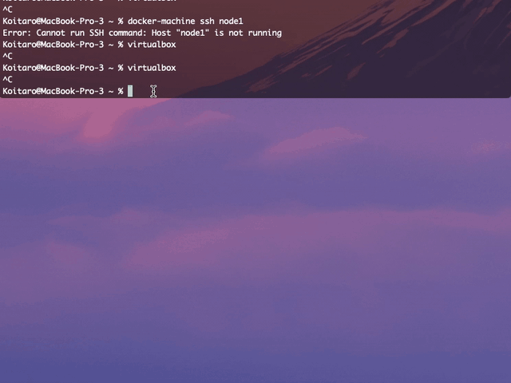
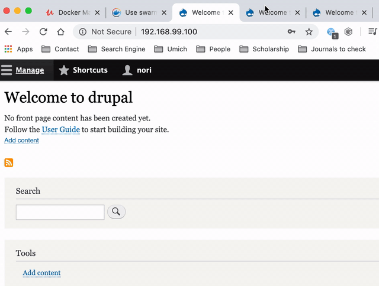
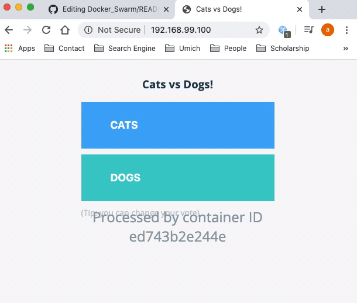

# Docker_Swarm
## Swam is for these problems

## Swarm Concept


## How to enable Swarm, Notice: Swarm is inactive by default
```
Koitaro@MacBook-Pro-3 ~ % docker info
Client:
 Debug Mode: false

Server:
 Containers: 6
  Running: 0
  Paused: 0
  Stopped: 6
 Images: 13
 Server Version: 19.03.8
 Storage Driver: overlay2
  Backing Filesystem: <unknown>
  Supports d_type: true
  Native Overlay Diff: true
 Logging Driver: json-file
 Cgroup Driver: cgroupfs
 Plugins:
  Volume: local
  Network: bridge host ipvlan macvlan null overlay
  Log: awslogs fluentd gcplogs gelf journald json-file local logentries splunk syslog
 Swarm: inactive
 Runtimes: runc
 Default Runtime: runc
 Init Binary: docker-init
 containerd version: 7ad184331fa3e55e52b890ea95e65ba581ae3429
 runc version: dc9208a3303feef5b3839f4323d9beb36df0a9dd
 init version: fec3683
 Security Options:
  seccomp
   Profile: default
 Kernel Version: 4.19.76-linuxkit
 Operating System: Docker Desktop
 OSType: linux
 Architecture: x86_64
 CPUs: 2
 Total Memory: 1.945GiB
 Name: docker-desktop
 ID: TJIT:5V7K:EVKC:OICK:HS4X:WHIG:C7WC:GP2W:X7JT:3PPQ:XBB7:UDQI
 Docker Root Dir: /var/lib/docker
 Debug Mode: true
  File Descriptors: 41
  Goroutines: 53
  System Time: 2020-05-24T14:12:55.5076433Z
  EventsListeners: 3
 HTTP Proxy: gateway.docker.internal:3128
 HTTPS Proxy: gateway.docker.internal:3129
 Registry: https://index.docker.io/v1/
 Labels:
 Experimental: false
 Insecure Registries:
  127.0.0.0/8
 Live Restore Enabled: false
 Product License: Community Engine
```
## How to initialize Swarm
## now we have a single node swarm with all the features and functionality

```
Koitaro@MacBook-Pro-3 ~ % docker swarm init
Swarm initialized: current node (zsymzt2bx4gpt12vq8qk0cqqn) is now a manager.

To add a worker to this swarm, run the following command:

    docker swarm join --token SWMTKN-1-3ycktgsxu7tjzvjd5vj8v1wmgxlitewj7vbw73l4y38lpffk3n-drd1ypmcvnfwe38m3aho6rqoo 192.168.65.3:2377

To add a manager to this swarm, run 'docker swarm join-token manager' and follow the instructions.
```
# Let's play around a single node
## docker node ls
```
Koitaro@MacBook-Pro-3 ~ % docker node ls
ID                            HOSTNAME            STATUS              AVAILABILITY        MANAGER STATUS      ENGINE VERSION
zsymzt2bx4gpt12vq8qk0cqqn *   docker-desktop      Ready               Active              Leader              19.03.8

```
## docker node --help
```
Koitaro@MacBook-Pro-3 ~ % docker node --help

Usage:	docker node COMMAND

Manage Swarm nodes

Commands:
  demote      Demote one or more nodes from manager in the swarm
  inspect     Display detailed information on one or more nodes
  ls          List nodes in the swarm
  promote     Promote one or more nodes to manager in the swarm
  ps          List tasks running on one or more nodes, defaults to current node
  rm          Remove one or more nodes from the swarm
  update      Update a node

Run 'docker node COMMAND --help' for more information on a command.
```
## docker swarm --help
```
Koitaro@MacBook-Pro-3 ~ % docker swarm --help

Usage:	docker swarm COMMAND

Manage Swarm

Commands:
  ca          Display and rotate the root CA
  init        Initialize a swarm
  join        Join a swarm as a node and/or manager
  join-token  Manage join tokens
  leave       Leave the swarm
  unlock      Unlock swarm
  unlock-key  Manage the unlock key
  update      Update the swarm

Run 'docker swarm COMMAND --help' for more information on a command.
```
## docker searvice --help
## service of the swarm replaces the docker run
```
Koitaro@MacBook-Pro-3 ~ % docker service --help

Usage:	docker service COMMAND

Manage services

Commands:
  create      Create a new service
  inspect     Display detailed information on one or more services
  logs        Fetch the logs of a service or task
  ls          List services
  ps          List the tasks of one or more services
  rm          Remove one or more services
  rollback    Revert changes to a service's configuration
  scale       Scale one or multiple replicated services
  update      Update a service

Run 'docker service COMMAND --help' for more information on a command.
```
## docker service create
## This is how we give it some new orders. Let's have it start the Alpine image. 8.8.8.8 is a Google DNS server.
## The ID is not container ID. This is service ID, which was already spun up 1/1. (how many actually running)/(how many you specify for it to run)
```
Koitaro@MacBook-Pro-3 ~ % docker service create alpine ping 8.8.8.8
pm8ioazf4q0q093h7ybvv864o
overall progress: 1 out of 1 tasks
1/1: running   [==================================================>]
verify: Service converged

Koitaro@MacBook-Pro-3 ~ % docker service ls
ID                  NAME                MODE                REPLICAS            IMAGE               PORTS
pm8ioazf4q0q        clever_yonath       replicated          1/1                 alpine:latest
```
## Where is containers? Let's give it the name of ID of the service, which gives us the tasks or containers for this service!
## This looks similar to docker container ls command, but notice that this has NODE component.
```
Koitaro@MacBook-Pro-3 ~ % docker service ps clever_yonath
ID                  NAME                IMAGE               NODE                DESIRED STATE       CURRENT STATE           ERROR               PORTS
5gcgur2xp1ks        clever_yonath.1     alpine:latest       docker-desktop      Running             Running 4 minutes ago
```
## docker container ls, still works
```
Koitaro@MacBook-Pro-3 ~ % docker container ls
CONTAINER ID        IMAGE               COMMAND             CREATED             STATUS              PORTS               NAMES
81bdcb835a50        alpine:latest       "ping 8.8.8.8"      6 minutes ago       Up 6 minutes                            clever_yonath.1.5gcgur2xp1ksjnligy0zmvgv5
```
## Let's scale it up
docker service update [ID of the service] --replicas 3
```
Koitaro@MacBook-Pro-3 ~ % docker service update pm8ioazf4q0q --replicas 3
pm8ioazf4q0q
overall progress: 3 out of 3 tasks
1/3: running   [==================================================>]
2/3: running   [==================================================>]
3/3: running   [==================================================>]
verify: Service converged
 
Koitaro@MacBook-Pro-3 ~ % docker service ls
ID                  NAME                MODE                REPLICAS            IMAGE               PORTS
pm8ioazf4q0q        clever_yonath       replicated          3/3                 alpine:latest
```
## docker service ps [name of the service]
## Now we see 3 tasks
```
Koitaro@MacBook-Pro-3 ~ % docker service ps clever_yonath
ID                  NAME                IMAGE               NODE                DESIRED STATE       CURRENT STATE                ERROR               PORTS
5gcgur2xp1ks        clever_yonath.1     alpine:latest       docker-desktop      Running             Running 11 minutes ago
i1ehu1gtvcar        clever_yonath.2     alpine:latest       docker-desktop      Running             Running about a minute ago
ebujk9qe7fqz        clever_yonath.3     alpine:latest       docker-desktop      Running             Running about a minute ago
```
## The always keeping something available in production as much as possible is one of the design goals of Swarm.
## Let's investigate it.
## docker update --help
```
Koitaro@MacBook-Pro-3 ~ % docker update --help

Usage:	docker update [OPTIONS] CONTAINER [CONTAINER...]

Update configuration of one or more containers

Options:
      --blkio-weight uint16        Block IO (relative weight), between 10 and 1000, or 0 to disable (default 0)
      --cpu-period int             Limit CPU CFS (Completely Fair Scheduler) period
      --cpu-quota int              Limit CPU CFS (Completely Fair Scheduler) quota
      --cpu-rt-period int          Limit the CPU real-time period in microseconds
      --cpu-rt-runtime int         Limit the CPU real-time runtime in microseconds
  -c, --cpu-shares int             CPU shares (relative weight)
      --cpus decimal               Number of CPUs
      --cpuset-cpus string         CPUs in which to allow execution (0-3, 0,1)
      --cpuset-mems string         MEMs in which to allow execution (0-3, 0,1)
      --kernel-memory bytes        Kernel memory limit
  -m, --memory bytes               Memory limit
      --memory-reservation bytes   Memory soft limit
      --memory-swap bytes          Swap limit equal to memory plus swap: '-1' to enable unlimited swap
      --pids-limit int             Tune container pids limit (set -1 for unlimited)
      --restart string             Restart policy to apply when a container exits
```
## docker service update --help
## The goal of a Swarm service is that it's able to replace containers and update changes in the service without taking the entire thing down. If you had a service with three containers in it, you could technically take down one at a time to make a change and do sort of rolling update. Swarm ensures the consistent availability.
```
Koitaro@MacBook-Pro-3 ~ % docker service update --help

Usage:	docker service update [OPTIONS] SERVICE

Update a service

Options:
      --args command                       Service command args
      --config-add config                  Add or update a config file on a service
      --config-rm list                     Remove a configuration file
      --constraint-add list                Add or update a placement constraint
      --constraint-rm list                 Remove a constraint
      --container-label-add list           Add or update a container label
      --container-label-rm list            Remove a container label by its key
      --credential-spec credential-spec    Credential spec for managed service account (Windows only)
  -d, --detach                             Exit immediately instead of waiting for the service to converge
      --dns-add list                       Add or update a custom DNS server
      --dns-option-add list                Add or update a DNS option
      --dns-option-rm list                 Remove a DNS option
      --dns-rm list                        Remove a custom DNS server
      --dns-search-add list                Add or update a custom DNS search domain
      --dns-search-rm list                 Remove a DNS search domain
      --endpoint-mode string               Endpoint mode (vip or dnsrr)
      --entrypoint command                 Overwrite the default ENTRYPOINT of the image
      --env-add list                       Add or update an environment variable
      --env-rm list                        Remove an environment variable
      --force                              Force update even if no changes require it
      --generic-resource-add list          Add a Generic resource
      --generic-resource-rm list           Remove a Generic resource
      --group-add list                     Add an additional supplementary user group to the container
      --group-rm list                      Remove a previously added supplementary user group from the container
      --health-cmd string                  Command to run to check health
      --health-interval duration           Time between running the check (ms|s|m|h)
      --health-retries int                 Consecutive failures needed to report unhealthy
      --health-start-period duration       Start period for the container to initialize before counting retries towards
                                           unstable (ms|s|m|h)
      --health-timeout duration            Maximum time to allow one check to run (ms|s|m|h)
      --host-add list                      Add a custom host-to-IP mapping (host:ip)
      --host-rm list                       Remove a custom host-to-IP mapping (host:ip)
      --hostname string                    Container hostname
      --image string                       Service image tag
      --init                               Use an init inside each service container to forward signals and reap processes
      --isolation string                   Service container isolation mode
      --label-add list                     Add or update a service label
      --label-rm list                      Remove a label by its key
      --limit-cpu decimal                  Limit CPUs
      --limit-memory bytes                 Limit Memory
      --log-driver string                  Logging driver for service
      --log-opt list                       Logging driver options
      --mount-add mount                    Add or update a mount on a service
      --mount-rm list                      Remove a mount by its target path
      --network-add network                Add a network
      --network-rm list                    Remove a network
      --no-healthcheck                     Disable any container-specified HEALTHCHECK
      --no-resolve-image                   Do not query the registry to resolve image digest and supported platforms
      --placement-pref-add pref            Add a placement preference
      --placement-pref-rm pref             Remove a placement preference
      --publish-add port                   Add or update a published port
      --publish-rm port                    Remove a published port by its target port
  -q, --quiet                              Suppress progress output
      --read-only                          Mount the container's root filesystem as read only
      --replicas uint                      Number of tasks
      --replicas-max-per-node uint         Maximum number of tasks per node (default 0 = unlimited)
      --reserve-cpu decimal                Reserve CPUs
      --reserve-memory bytes               Reserve Memory
      --restart-condition string           Restart when condition is met ("none"|"on-failure"|"any")
      --restart-delay duration             Delay between restart attempts (ns|us|ms|s|m|h)
      --restart-max-attempts uint          Maximum number of restarts before giving up
      --restart-window duration            Window used to evaluate the restart policy (ns|us|ms|s|m|h)
      --rollback                           Rollback to previous specification
      --rollback-delay duration            Delay between task rollbacks (ns|us|ms|s|m|h)
      --rollback-failure-action string     Action on rollback failure ("pause"|"continue")
      --rollback-max-failure-ratio float   Failure rate to tolerate during a rollback
      --rollback-monitor duration          Duration after each task rollback to monitor for failure (ns|us|ms|s|m|h)
      --rollback-order string              Rollback order ("start-first"|"stop-first")
      --rollback-parallelism uint          Maximum number of tasks rolled back simultaneously (0 to roll back all at once)
      --secret-add secret                  Add or update a secret on a service
      --secret-rm list                     Remove a secret
      --stop-grace-period duration         Time to wait before force killing a container (ns|us|ms|s|m|h)
      --stop-signal string                 Signal to stop the container
      --sysctl-add list                    Add or update a Sysctl option
      --sysctl-rm list                     Remove a Sysctl option
  -t, --tty                                Allocate a pseudo-TTY
      --update-delay duration              Delay between updates (ns|us|ms|s|m|h)
      --update-failure-action string       Action on update failure ("pause"|"continue"|"rollback")
      --update-max-failure-ratio float     Failure rate to tolerate during an update
      --update-monitor duration            Duration after each task update to monitor for failure (ns|us|ms|s|m|h)
      --update-order string                Update order ("start-first"|"stop-first")
      --update-parallelism uint            Maximum number of tasks updated simultaneously (0 to update all at once)
  -u, --user string                        Username or UID (format: <name|uid>[:<group|gid>])
      --with-registry-auth                 Send registry authentication details to swarm agents
  -w, --workdir string                     Working directory inside the container
```
## Let's remove one of containers
## docker container rm -f [name].1.[ID]
## the deleted container will be replaces with new one imediately
This is one of the responsibilities of a container orchestration system to make sure the services you specify are always running, and if they fail, it recovers from that failure. This is the difference from docker run. docker run would never re-create a container. We are actually telling an orchestration system to put this job in your queue.
```
Koitaro@MacBook-Pro-3 ~ % docker container ls
CONTAINER ID        IMAGE               COMMAND             CREATED             STATUS              PORTS               NAMES
2eaa8f902558        alpine:latest       "ping 8.8.8.8"      52 minutes ago      Up 52 minutes                           clever_yonath.2.i1ehu1gtvcarauyyd37w1yg44
5ec148e81b5c        alpine:latest       "ping 8.8.8.8"      52 minutes ago      Up 52 minutes                           clever_yonath.3.ebujk9qe7fqzdfhexid4q5ruq
81bdcb835a50        alpine:latest       "ping 8.8.8.8"      About an hour ago   Up About an hour                        clever_yonath.1.5gcgur2xp1ksjnligy0zmvgv5

Koitaro@MacBook-Pro-3 ~ % docker container rm -f clever_yonath.1.5gcgur2xp1ksjnligy0zmvgv5
clever_yonath.1.5gcgur2xp1ksjnligy0zmvgv5

Koitaro@MacBook-Pro-3 ~ % docker service ls
ID                  NAME                MODE                REPLICAS            IMAGE               PORTS
pm8ioazf4q0q        clever_yonath       replicated          2/3                 alpine:latest

# 1 second later
Koitaro@MacBook-Pro-3 ~ % docker service ls
ID                  NAME                MODE                REPLICAS            IMAGE               PORTS
pm8ioazf4q0q        clever_yonath       replicated          3/3                 alpine:latest

Koitaro@MacBook-Pro-3 ~ % docker service ps clever_yonath
ID                  NAME                  IMAGE               NODE                DESIRED STATE       CURRENT STATE                ERROR                         PORTS
n1ru2x2mrg87        clever_yonath.1       alpine:latest       docker-desktop      Running             Running about a minute ago
5gcgur2xp1ks         \_ clever_yonath.1   alpine:latest       docker-desktop      Shutdown            Failed about a minute ago    "task: non-zero exit (137)"
i1ehu1gtvcar        clever_yonath.2       alpine:latest       docker-desktop      Running             Running 55 minutes ago
ebujk9qe7fqz        clever_yonath.3       alpine:latest       docker-desktop      Running             Running 55 minutes ago
```
## To remove all containers, we need to remove the service itself.
```
Koitaro@MacBook-Pro-3 ~ % docker service ls
ID                  NAME                MODE                REPLICAS            IMAGE               PORTS
pm8ioazf4q0q        clever_yonath       replicated          3/3                 alpine:latest

Koitaro@MacBook-Pro-3 ~ % docker service ls
ID                  NAME                MODE                REPLICAS            IMAGE               PORTS
pm8ioazf4q0q        clever_yonath       replicated          3/3                 alpine:latest
Koitaro@MacBook-Pro-3 ~ % docker service rm clever_yonath
clever_yonath

Koitaro@MacBook-Pro-3 ~ % docker service ls
ID                  NAME                MODE                REPLICAS            IMAGE               PORTS

Koitaro@MacBook-Pro-3 ~ % docker container ls
CONTAINER ID        IMAGE               COMMAND             CREATED             STATUS              PORTS               NAMES
```


# This time, I use play-with-docker.com
[play-with-docker.com](https://labs.play-with-docker.com/)
## we need to specify IP address to adertise the swarm service on
```
[node1] (local) root@192.168.0.28 ~
$ docker swarm init
Error response from daemon: could not choose an IP address to advertise since this system has multiple addresses on different interfaces (192.168.0.28 on eth0 and 172.18.0.75 on eth1) - specify one with --advertise-addr

[node1] (local) root@192.168.0.28 ~
$ docker swarm init --advertise-addr 192.168.0.28
Swarm initialized: current node (74hruvkd4py5eq90bbnijbsp0) is now a manager.

To add a worker to this swarm, run the following command:

    docker swarm join --token SWMTKN-1-1xn67gwo7uaqjlt9yplj2b58y1d44h57je81uga8fpk9cxvobt-bsnsq0o1s867q0mg13do0vkk3 192.168.0.28:2377

To add a manager to this swarm, run 'docker swarm join-token manager' and follow the instructions.
```
## Let's add node2 in this swarm as a worker, by copying and pasting the code above in node2
## Now, node2 is a part of swarm, and notice that we cannot use swarm command in node2 because node2 is not manager, just a worker. A worker doesn't have access to control the swarm.
```
[node2] (local) root@192.168.0.27 ~
$ docker swarm join --token SWMTKN-1-1xn67gwo7uaqjlt9yplj2b58y1d44h57je81uga8fpk9cxvobt-bsnsq0o1s867q0mg13do0vkk3 192.168.0.28:2377
This node joined a swarm as a worker.

[node2] (local) root@192.168.0.27 ~
$ docker node ls
Error response from daemon: This node is not a swarm manager. Worker nodes can't be used to view or modify cluster state. Please run this command on a manager node or promote the current node to a manager.
```
## Check if the node is added
```
[node1] (local) root@192.168.0.28 ~
$ docker node ls
ID                            HOSTNAME            STATUS              AVAILABILITY        MANAGER STATUS      ENGINE VERSION
74hruvkd4py5eq90bbnijbsp0 *   node1               Ready               Active              Leader              19.03.4
v5aka5geemy6hi8hs4fbc1q6l     node2               Ready               Active                                  19.03.4
```
## Let's update node2 to be a manager
```
[node1] (local) root@192.168.0.28 ~
$ docker node update --help

Usage:  docker node update [OPTIONS] NODE

Update a node

Options:
      --availability string   Availability of the node ("active"|"pause"|"drain")
      --label-add list        Add or update a node label (key=value)
      --label-rm list         Remove a node label if exists
      --role string           Role of the node ("worker"|"manager")


[node1] (local) root@192.168.0.28 ~
$ docker node update --role manager node2
node2

[node1] (local) root@192.168.0.28 ~
$ docker node ls
ID                            HOSTNAME            STATUS              AVAILABILITY        MANAGER STATUS      ENGINE VERSION
74hruvkd4py5eq90bbnijbsp0 *   node1               Ready               Active              Leader              19.03.4
v5aka5geemy6hi8hs4fbc1q6l     node2               Ready               Active              Reachable           19.03.4
```
## This time, let's add node3 as manager by default
## We need to get join-token from the original swarm, then copy and paste it in node3 for node3 to be a manager by default
```
[node1] (local) root@192.168.0.28 ~
$ docker swarm join-token manager
To add a manager to this swarm, run the following command:

    docker swarm join --token SWMTKN-1-1xn67gwo7uaqjlt9yplj2b58y1d44h57je81uga8fpk9cxvobt-5h04p5igvyl83s40prntahi5x 192.168.0.28:2377

[node3] (local) root@192.168.0.26 ~
$ docker swarm join --token SWMTKN-1-1xn67gwo7uaqjlt9yplj2b58y1d44h57je81uga8fpk9cxvobt-5h04p5igvyl83s40prntahi5x 192.168.0.28:2377
This node joined a swarm as a manager.

[node1] (local) root@192.168.0.28 ~
$ docker node ls
ID                            HOSTNAME            STATUS              AVAILABILITY        MANAGER STATUS      ENGINE VERSION
74hruvkd4py5eq90bbnijbsp0 *   node1               Ready               Active              Leader              19.03.4
v5aka5geemy6hi8hs4fbc1q6l     node2               Ready               Active              Reachable           19.03.4
821gtgucblcujt10x1nbt8zev     node3               Ready               Active              Reachable           19.03.4
```
## Now we have 3 node, redundant swarm with 3 managers.
## Let's create a service with 3 replicas
## We can operate the whole swarm from node1
```
[node1] (local) root@192.168.0.28 ~
$ docker service create --replicas 3 alpine ping 8.8.8.8
image alpine:latest could not be accessed on a registry to record
its digest. Each node will access alpine:latest independently,
possibly leading to different nodes running different
versions of the image.

rfifxglixz4qce1orqvxsh7tp
overall progress: 3 out of 3 tasks 
1/3: running   
2/3: running   
3/3: running   
verify: Service converged 

[node1] (local) root@192.168.0.28 ~
$ docker service ls
ID                  NAME                MODE                REPLICAS            IMAGE               PORTS
rfifxglixz4q        gallant_cori        replicated          3/3                 alpine:latest       


[node1] (local) root@192.168.0.28 ~
$ docker node ps
ID                  NAME                IMAGE               NODE                DESIRED STATE       CURRENT STATE                 ERROR                            PORTS
qw5f6sdyntk0        gallant_cori.1      alpine:latest       node1               Shutdown            Rejected about a minute ago   "No such image: alpine:latest"   
k5ohmcs104d2        gallant_cori.2      alpine:latest       node1               Shutdown            Rejected about a minute ago   "No such image: alpine:latest"   
vkd9ov0c6yzw        gallant_cori.3      alpine:latest       node1               Shutdown            Rejected about a minute ago   "No such image: alpine:latest"   

[node1] (local) root@192.168.0.28 ~
$ docker service ps gallant_cori
ID                  NAME                 IMAGE               NODE                DESIRED STATE       CURRENT STATE            ERROR                            PORTS
3xmspdqjqtti        gallant_cori.1       alpine:latest       node2               Running             Running 5 minutes ago                 
4lcuzo8zpw6v        gallant_cori.2       alpine:latest       node2               Running             Running 5 minutes ago                 
rjfquzav07q5        gallant_cori.3       alpine:latest       node2               Running             Running 5 minutes ago                 
```
## 'docker swarm init' is how a single node initializes a swarm, and is automatically joined as a manager.
## 'docker service update [service name] --replicas #' is to update the service and "scale up" the service to a desired amount. Bonus: a shorter way to do it is with a "docker service scale" command.
## "docker node update --role" command can update a role of another node from a manager node.
---
# Multi Nodes with docker-machine and virtualbox
## docker-machine install, and virtualbox
```
Koitaro@MacBook-Pro-3 ~ % docker-machine
zsh: command not found: docker-machine
Koitaro@MacBook-Pro-3 ~ % virtualbox
Koitaro@MacBook-Pro-3 ~ % base=https://github.com/docker/machine/releases/download/v0.16.0 &&
  curl -L $base/docker-machine-$(uname -s)-$(uname -m) >/usr/local/bin/docker-machine &&
  chmod +x /usr/local/bin/docker-machine
  % Total    % Received % Xferd  Average Speed   Time    Time     Time  Current
                                 Dload  Upload   Total   Spent    Left  Speed
100   639  100   639    0     0    469      0  0:00:01  0:00:01 --:--:--   469
100 32.0M  100 32.0M    0     0  1782k      0  0:00:18  0:00:18 --:--:-- 2072k

Koitaro@MacBook-Pro-3 ~ % docker-machine version
docker-machine version 0.16.0, build 702c267f

Koitaro@MacBook-Pro-3 ~ % docker-machine
Usage: docker-machine [OPTIONS] COMMAND [arg...]

Create and manage machines running Docker.

Version: 0.16.0, build 702c267f

Author:
  Docker Machine Contributors - <https://github.com/docker/machine>

Options:
  --debug, -D						Enable debug mode
  --storage-path, -s "/Users/Koitaro/.docker/machine"	Configures storage path [$MACHINE_STORAGE_PATH]
  --tls-ca-cert 					CA to verify remotes against [$MACHINE_TLS_CA_CERT]
  --tls-ca-key 						Private key to generate certificates [$MACHINE_TLS_CA_KEY]
  --tls-client-cert 					Client cert to use for TLS [$MACHINE_TLS_CLIENT_CERT]
  --tls-client-key 					Private key used in client TLS auth [$MACHINE_TLS_CLIENT_KEY]
  --github-api-token 					Token to use for requests to the Github API [$MACHINE_GITHUB_API_TOKEN]
  --native-ssh						Use the native (Go-based) SSH implementation. [$MACHINE_NATIVE_SSH]
  --bugsnag-api-token 					BugSnag API token for crash reporting [$MACHINE_BUGSNAG_API_TOKEN]
  --help, -h						show help
  --version, -v						print the version

Commands:
  active		Print which machine is active
  config		Print the connection config for machine
  create		Create a machine
  env			Display the commands to set up the environment for the Docker client
  inspect		Inspect information about a machine
  ip			Get the IP address of a machine
  kill			Kill a machine
  ls			List machines
  provision		Re-provision existing machines
  regenerate-certs	Regenerate TLS Certificates for a machine
  restart		Restart a machine
  rm			Remove a machine
  ssh			Log into or run a command on a machine with SSH.
  scp			Copy files between machines
  mount			Mount or unmount a directory from a machine with SSHFS.
  start			Start a machine
  status		Get the status of a machine
  stop			Stop a machine
  upgrade		Upgrade a machine to the latest version of Docker
  url			Get the URL of a machine
  version		Show the Docker Machine version or a machine docker version
  help			Shows a list of commands or help for one command

Run 'docker-machine COMMAND --help' for more information on a command.
```
## Let's create node1, node2, node3
## do docker-machine create 3 times for node1, node2, node3
```
Koitaro@MacBook-Pro-3 ~ % docker-machine create node1
Creating CA: /Users/Koitaro/.docker/machine/certs/ca.pem
Creating client certificate: /Users/Koitaro/.docker/machine/certs/cert.pem
Running pre-create checks...
(node1) Image cache directory does not exist, creating it at /Users/Koitaro/.docker/machine/cache...
(node1) No default Boot2Docker ISO found locally, downloading the latest release...
(node1) Latest release for github.com/boot2docker/boot2docker is v19.03.5
(node1) Downloading /Users/Koitaro/.docker/machine/cache/boot2docker.iso from https://github.com/boot2docker/boot2docker/releases/download/v19.03.5/boot2docker.iso...
(node1) 0%....10%....20%....30%....40%....50%....60%....70%....80%....90%....100%
Creating machine...
(node1) Copying /Users/Koitaro/.docker/machine/cache/boot2docker.iso to /Users/Koitaro/.docker/machine/machines/node1/boot2docker.iso...
(node1) Creating VirtualBox VM...
(node1) Creating SSH key...
(node1) Starting the VM...
(node1) Check network to re-create if needed...
(node1) Found a new host-only adapter: "vboxnet0"
(node1) Waiting for an IP...
Waiting for machine to be running, this may take a few minutes...
Detecting operating system of created instance...
Waiting for SSH to be available...
Detecting the provisioner...
Provisioning with boot2docker...
Copying certs to the local machine directory...
Copying certs to the remote machine...
Setting Docker configuration on the remote daemon...
Checking connection to Docker...
Docker is up and running!
To see how to connect your Docker Client to the Docker Engine running on this virtual machine, run: docker-machine env node1
```
## Let's open 3 command lines and go into node1, node2, node3

```
Koitaro@MacBook-Pro-3 ~ % docker-machine ssh node1
   ( '>')
  /) TC (\   Core is distributed with ABSOLUTELY NO WARRANTY.
 (/-_--_-\)           www.tinycorelinux.net

docker@node1:~$ docker info

Koitaro@MacBook-Pro-3 ~ % docker-machine ssh node2
   ( '>')
  /) TC (\   Core is distributed with ABSOLUTELY NO WARRANTY.
 (/-_--_-\)           www.tinycorelinux.net

docker@node2:~$

Koitaro@MacBook-Pro-3 ~ % docker-machine ssh node3
   ( '>')
  /) TC (\   Core is distributed with ABSOLUTELY NO WARRANTY.
 (/-_--_-\)           www.tinycorelinux.net

docker@node3:~$
```
## When you do docker swarm init, it wants us to specify an IP address to advertise the Swarm service on!
## We want to use an IP address that is accessible from the other servers.
```
docker@node1:~$ docker swarm init
Error response from daemon: could not choose an IP address to advertise since this system has multiple addresses on different interfaces (10.0.2.15 on eth0 and 192.168.99.100 on eth1) - specify one with --advertise-addr

docker@node1:~$ docker swarm init --advertise-addr 10.0.2.15
Swarm initialized: current node (4nvrt57791ae1j3cb1b6h3ksr) is now a manager.

To add a worker to this swarm, run the following command:

    docker swarm join --token SWMTKN-1-0w9m13lpppet7r3cpjtkcam6uhaeb8gvnl3wq7sr2nqjamyu0q-6tchckkfd3cfvd4bfh2adqnw9 10.0.2.15:2377

To add a manager to this swarm, run 'docker swarm join-token manager' and follow the instructions.

```
## Now, let's let node2 join the swarm as a worker, just copy and paste on node2 in the command line.
### I got an error, This is probably because I am running Virtual Box. This mean that some of your interfaces are shared with other VMs and the host. If you run ifconfig on your VMs and host, Choose the interface which exhibit different IPs for every machine VM. I had this problem, too and figured out that the eth0 IPs were the same on every machine. Of course, this cannot work. eth1 also had different IPs for every machine.
```
<m6uhaeb8gvnl3wq7sr2nqjamyu0q-6tchckkfd3cfvd4bfh2adqnw9 10.0.2.15:2377
Error response from daemon: rpc error: code = Unavailable desc = all SubConns are in TransientFailure, latest connection error: connection error: desc = "transport: Error while dialing dial tcp 10.0.2.15:2377: connect: connection refused"

docker@node1:~$ docker swarm leave --force
Node left the swarm.
```
## Instead, I used eth1 when I did docker swarm init, instead of eth0
## Then, let node2 join the swarm, successfully. Now, node2 is a part of the swarm.
```
docker@node1:~$ docker swarm init --advertise-addr 192.168.99.100
Swarm initialized: current node (gojgdw59ie6h4jn2rdsdzlojj) is now a manager.

To add a worker to this swarm, run the following command:

    docker swarm join --token SWMTKN-1-1eh4g3srww28yxghcwvvklq8npg5dd3nkm5v5v2tpnw9rth6t4-b25pukbfakc3rjolt4vk6xqq5 192.168.99.100:2377

To add a manager to this swarm, run 'docker swarm join-token manager' and follow the instructions.

docker@node2:~$ docker swarm join --token SWMTKN-1-1eh4g3srww28yxghcwvvklq8npg5dd3nkm5v5v2tpnw9rth6t4-b25pukbfakc3rjolt4vk6xqq5 192.168.99.100:2377
This node joined a swarm as a worker.
```
## Let's check if I have two nodes working. Notice that node2 is a worker, not a manager.
```
docker@node1:~$ docker node ls
ID                            HOSTNAME            STATUS              AVAILABILITY        MANAGER STATUS      ENGINE VERSION
gojgdw59ie6h4jn2rdsdzlojj *   node1               Ready               Active              Leader              19.03.5
p71mmbgxygp9pvq2xmwydjg32     node2               Ready               Active                                  19.03.5
```
## Let's update node2 as a manager
## Now, node2 is also a manager
```
docker@node1:~$ docker node --help

Usage:	docker node COMMAND

Manage Swarm nodes

Commands:
  demote      Demote one or more nodes from manager in the swarm
  inspect     Display detailed information on one or more nodes
  ls          List nodes in the swarm
  promote     Promote one or more nodes to manager in the swarm
  ps          List tasks running on one or more nodes, defaults to current node
  rm          Remove one or more nodes from the swarm
  update      Update a node

Run 'docker node COMMAND --help' for more information on a command.

docker@node1:~$ docker node update --help

Usage:	docker node update [OPTIONS] NODE

Update a node

Options:
      --availability string   Availability of the node ("active"|"pause"|"drain")
      --label-add list        Add or update a node label (key=value)
      --label-rm list         Remove a node label if exists
      --role string           Role of the node ("worker"|"manager")
      
docker@node1:~$ docker node update --role manager node2
node2

docker@node1:~$ docker node ls
ID                            HOSTNAME            STATUS              AVAILABILITY        MANAGER STATUS      ENGINE VERSION
gojgdw59ie6h4jn2rdsdzlojj *   node1               Ready               Active              Leader              19.03.5
p71mmbgxygp9pvq2xmwydjg32     node2               Ready               Active              Reachable           19.03.5
```
## Let's add node3 into the swarm as a manager by default
## we need to get join-token manager, and copy/paste it in node3
## Now, all three nodes are managers and node1 is leader
```
docker@node1:~$ docker swarm join-token manager
To add a manager to this swarm, run the following command:

    docker swarm join --token SWMTKN-1-1eh4g3srww28yxghcwvvklq8npg5dd3nkm5v5v2tpnw9rth6t4-6gajne8y5as6qzvfmst6hg0ff 192.168.99.100:2377

docker@node3:~$ docker swarm join --token SWMTKN-1-1eh4g3srww28yxghcwvvklq8npg5dd3nkm5v5v2tpnw9rth6t4-6gajne8y5as6qzvfmst6hg0ff 192.168.99.100:2377
This node joined a swarm as a manager.

docker@node1:~$ docker node ls
ID                            HOSTNAME            STATUS              AVAILABILITY        MANAGER STATUS      ENGINE VERSION
gojgdw59ie6h4jn2rdsdzlojj *   node1               Ready               Active              Leader              19.03.5
p71mmbgxygp9pvq2xmwydjg32     node2               Ready               Active              Reachable           19.03.5
tpk14payxih56xrjilciyfqcd     node3               Ready               Active              Reachable           19.03.5
```
## Now we have 3 node, redundant swarm with 3 managers.
## Let's create a service with 3 replicas
## We can operate the whole swarm from node1
```
docker@node1:~$ docker service create --replicas 3 alpine ping 8.8.8.8
wwa38vyp3132fjwqa9yomy5br
overall progress: 3 out of 3 tasks
1/3: running
2/3: running
3/3: running
verify: Service converged

docker@node1:~$ docker service ls
ID                  NAME                  MODE                REPLICAS            IMAGE               PORTS
wwa38vyp3132        flamboyant_einstein   replicated          3/3                 alpine:latest
```
## Let's check if my local node is running a container/task
## we can also specify node
```
docker@node1:~$ docker node ps
ID                  NAME                    IMAGE               NODE                DESIRED STATE       CURRENT STATE           ERROR               PORTS
u1zgdp8eh2lp        flamboyant_einstein.3   alpine:latest       node1               Running             Running 2 minutes ago

docker@node1:~$ docker node ps node2
ID                  NAME                    IMAGE               NODE                DESIRED STATE       CURRENT STATE           ERROR               PORTS
p6cl826qeq2h        flamboyant_einstein.1   alpine:latest       node2               Running             Running 3 minutes ago

docker@node1:~$ docker node ps node3
ID                  NAME                    IMAGE               NODE                DESIRED STATE       CURRENT STATE           ERROR               PORTS
3fzbrso28iqd        flamboyant_einstein.2   alpine:latest       node3               Running             Running 3 minutes ago
```
## we can also see the full list by docker service ps [name_of_our_service], listing all 3 tasks/containers
```
docker@node1:~$ docker service ps flamboyant_einstein
ID                  NAME                    IMAGE               NODE                DESIRED STATE       CURRENT STATE           ERROR               PORTS
p6cl826qeq2h        flamboyant_einstein.1   alpine:latest       node2               Running             Running 5 minutes ago
3fzbrso28iqd        flamboyant_einstein.2   alpine:latest       node3               Running             Running 5 minutes ago
u1zgdp8eh2lp        flamboyant_einstein.3   alpine:latest       node1               Running             Running 5 minutes ago
```
## Now, remove the service and check the status of nodes
```
docker@node1:~$ docker service ls
ID                  NAME                  MODE                REPLICAS            IMAGE               PORTS
wwa38vyp3132        flamboyant_einstein   replicated          3/3                 alpine:latest

docker@node1:~$ docker service rm flamboyant_einstein
flamboyant_einstein

docker@node1:~$ docker service ls
ID                  NAME                MODE                REPLICAS            IMAGE               PORTS

docker@node1:~$ docker node ps node1
ID                  NAME                IMAGE               NODE                DESIRED STATE       CURRENT STATE       ERROR               PORTS

docker@node1:~$ docker node ps node2
ID                  NAME                IMAGE               NODE                DESIRED STATE       CURRENT STATE       ERROR               PORTS

docker@node1:~$ docker node ps node3
ID                  NAME                IMAGE               NODE                DESIRED STATE       CURRENT STATE       ERROR               PORTS

docker@node1:~$ docker container ls
CONTAINER ID        IMAGE               COMMAND             CREATED             STATUS              PORTS               NAMES
```
# How to start running nodes in virtualbox
## when you close everything, machines (we named a machine as node1,2,3) are powered off. So we need to start running machines first to use nodes in swarm. 

```
Koitaro@MacBook-Pro-3 ~ % docker swarm leave --force
Node left the swarm.

Koitaro@MacBook-Pro-3 ~ % docker swarm init
Swarm initialized: current node (h8jh5jxmwpz8vgiawmtsjew01) is now a manager.

To add a worker to this swarm, run the following command:

    docker swarm join --token SWMTKN-1-4amnvqkbdew4nsafwm2ib9wvd4xuczzrafrdketsjj7ydq8rne-1ofouitkrzitm396vabjybtiz 192.168.65.3:2377

To add a manager to this swarm, run 'docker swarm join-token manager' and follow the instructions.

Koitaro@MacBook-Pro-3 ~ % docker node ls
ID                            HOSTNAME            STATUS              AVAILABILITY        MANAGER STATUS      ENGINE VERSION
h8jh5jxmwpz8vgiawmtsjew01 *   docker-desktop      Ready               Active              Leader              19.03.8

Koitaro@MacBook-Pro-3 ~ % docker-machine ssh node1
Error: Cannot run SSH command: Host "node1" is not running

# after start running a machine named node1
Koitaro@MacBook-Pro-3 ~ % docker-machine ssh node1
   ( '>')
  /) TC (\   Core is distributed with ABSOLUTELY NO WARRANTY.
 (/-_--_-\)           www.tinycorelinux.net
```
# Overlay, scalling out with overlay networking
### Let's try deploying the Drupal example with Postgres Database as services, and create an Overlay network for them to talk to each other.
- First, create a network called mydrupal with driver overlay
- Second, create our Postgres service called psql with network, password environment variable, and postgres image
- Third, create the other service with name drupal, network we just created, port, and drupal image
### Now, the database and drupal website are running in nodes

```
Koitaro@MacBook-Pro-3 ~ % docker-machine ssh node1
   ( '>')
  /) TC (\   Core is distributed with ABSOLUTELY NO WARRANTY.
 (/-_--_-\)           www.tinycorelinux.net

docker@node1:~$ docker network create --driver overlay mydrupal
3rh9ho1sjyb34mvop266mfte0

docker@node1:~$ docker network ls
NETWORK ID          NAME                DRIVER              SCOPE
67e05c0d0eb5        bridge              bridge              local
3755dbc21ddb        docker_gwbridge     bridge              local
f31843e26e2b        host                host                local
qepcjlcmncfp        ingress             overlay             swarm
3rh9ho1sjyb3        mydrupal            overlay             swarm
852f7fbf1ea8        none                null                local

docker@node1:~$ docker service create --name psql --network mydrupal -e POSTGRES_PASSWORD=mypass postgres                                 
iu39k9pnrfdypa7j1slloblop
overall progress: 1 out of 1 tasks
1/1: running
verify: Service converged

docker@node1:~$ docker service ls
ID                  NAME                MODE                REPLICAS            IMAGE               PORTS
iu39k9pnrfdy        psql                replicated          1/1                 postgres:latest

# service psql is running on node1
docker@node1:~$ docker service ps psql
ID                  NAME                IMAGE               NODE                DESIRED STATE       CURRENT STATE           ERROR               PORTS
t3lq6jqk7nhh        psql.1              postgres:latest     node1               Running             Running 2 minutes ago
```
### Check the logs of container for psql.1 service, ID is filled by tab completion
```
docker@node1:~$ docker container logs psql.1.t3lq6jqk7nhh4y1b83rjhas5q
The files belonging to this database system will be owned by user "postgres".
This user must also own the server process.

The database cluster will be initialized with locale "en_US.utf8".
The default database encoding has accordingly been set to "UTF8".
The default text search configuration will be set to "english".

Data page checksums are disabled.

fixing permissions on existing directory /var/lib/postgresql/data ... ok
creating subdirectories ... ok
selecting dynamic shared memory implementation ... posix
selecting default max_connections ... 100
selecting default shared_buffers ... 128MB
selecting default time zone ... Etc/UTC
creating configuration files ... ok
running bootstrap script ... ok
performing post-bootstrap initialization ... ok
syncing data to disk ... ok

initdb: warning: enabling "trust" authentication for local connections
You can change this by editing pg_hba.conf or using the option -A, or
--auth-local and --auth-host, the next time you run initdb.

Success. You can now start the database server using:

    pg_ctl -D /var/lib/postgresql/data -l logfile start

waiting for server to start....2020-05-25 15:54:22.197 UTC [45] LOG:  starting PostgreSQL 12.3 (Debian 12.3-1.pgdg100+1) on x86_64-pc-linux-gnu, compiled by gcc (Debian 8.3.0-6) 8.3.0, 64-bit
2020-05-25 15:54:22.198 UTC [45] LOG:  listening on Unix socket "/var/run/postgresql/.s.PGSQL.5432"
2020-05-25 15:54:22.211 UTC [46] LOG:  database system was shut down at 2020-05-25 15:54:21 UTC
2020-05-25 15:54:22.215 UTC [45] LOG:  database system is ready to accept connections
 done
server started

/usr/local/bin/docker-entrypoint.sh: ignoring /docker-entrypoint-initdb.d/*

2020-05-25 15:54:22.288 UTC [45] LOG:  received fast shutdown request
waiting for server to shut down....2020-05-25 15:54:22.289 UTC [45] LOG:  aborting any active transactions
2020-05-25 15:54:22.293 UTC [45] LOG:  background worker "logical replication launcher" (PID 52) exited with exit code 1
2020-05-25 15:54:22.294 UTC [47] LOG:  shutting down
2020-05-25 15:54:22.303 UTC [45] LOG:  database system is shut down
 done
server stopped

PostgreSQL init process complete; ready for start up.

2020-05-25 15:54:22.405 UTC [1] LOG:  starting PostgreSQL 12.3 (Debian 12.3-1.pgdg100+1) on x86_64-pc-linux-gnu, compiled by gcc (Debian 8.3.0-6) 8.3.0, 64-bit
2020-05-25 15:54:22.405 UTC [1] LOG:  listening on IPv4 address "0.0.0.0", port 5432
2020-05-25 15:54:22.405 UTC [1] LOG:  listening on IPv6 address "::", port 5432
2020-05-25 15:54:22.407 UTC [1] LOG:  listening on Unix socket "/var/run/postgresql/.s.PGSQL.5432"
2020-05-25 15:54:22.419 UTC [54] LOG:  database system was shut down at 2020-05-25 15:54:22 UTC
2020-05-25 15:54:22.422 UTC [1] LOG:  database system is ready to accept connections
```
### Let's create the other service with name of the service, name of network, publishing port, and drupal image
### drupal is runnning on node2, so now the database is running on node1 and the drupal website is running on node2
```
docker@node1:~$ docker service create --name drupal --network mydrupal -p 80:80 drupal
j9ii5oryi4bbhq824zcvv9frw
overall progress: 1 out of 1 tasks
1/1: running
verify: Service converged

docker@node1:~$ docker service ls
ID                  NAME                MODE                REPLICAS            IMAGE               PORTS
j9ii5oryi4bb        drupal              replicated          1/1                 drupal:latest       *:80->80/tcp
iu39k9pnrfdy        psql                replicated          1/1                 postgres:latest

docker@node1:~$ docker service ps drupal
ID                  NAME                IMAGE               NODE                DESIRED STATE       CURRENT STATE                ERROR               PORTS
qvpto79pnimi        drupal.1            drupal:latest       node2               Running             Running about a minute ago
```
## Let's go to the site by using IP address of node
## To check the IP address, you can use docker node inspect [node_name], and copy and paste the IP address in the browser
```
docker@node1:~$ docker node --help

Usage:	docker node COMMAND

Manage Swarm nodes

Commands:
  demote      Demote one or more nodes from manager in the swarm
  inspect     Display detailed information on one or more nodes
  ls          List nodes in the swarm
  promote     Promote one or more nodes to manager in the swarm
  ps          List tasks running on one or more nodes, defaults to current node
  rm          Remove one or more nodes from the swarm
  update      Update a node

Run 'docker node COMMAND --help' for more information on a command.
docker@node1:~$ docker node inspect node1
[
    {
        "ID": "gojgdw59ie6h4jn2rdsdzlojj",
        "Version": {
            "Index": 81
        },
        "CreatedAt": "2020-05-25T01:58:29.59181711Z",
        "UpdatedAt": "2020-05-25T15:53:29.843731511Z",
        "Spec": {
            "Labels": {},
            "Role": "manager",
            "Availability": "active"
        },
        "Description": {
            "Hostname": "node1",
            "Platform": {
                "Architecture": "x86_64",
                "OS": "linux"
            },
            "Resources": {
                "NanoCPUs": 1000000000,
                "MemoryBytes": 1037537280
            },
            "Engine": {
                "EngineVersion": "19.03.5",
                "Labels": {
                    "provider": "virtualbox"
                },
                "Plugins": [
                    {
                        "Type": "Log",
                        "Name": "awslogs"
                    },
                    {
                        "Type": "Log",
                        "Name": "fluentd"
                    },
                    {
                        "Type": "Log",
                        "Name": "gcplogs"
                    },
                    {
                        "Type": "Log",
                        "Name": "gelf"
                    },
                    {
                        "Type": "Log",
                        "Name": "journald"
                    },
                    {
                        "Type": "Log",
                        "Name": "json-file"
                    },
                    {
                        "Type": "Log",
                        "Name": "local"
                    },
                    {
                        "Type": "Log",
                        "Name": "logentries"
                    },
                    {
                        "Type": "Log",
                        "Name": "splunk"
                    },
                    {
                        "Type": "Log",
                        "Name": "syslog"
                    },
                    {
                        "Type": "Network",
                        "Name": "bridge"
                    },
                    {
                        "Type": "Network",
                        "Name": "host"
                    },
                    {
                        "Type": "Network",
                        "Name": "ipvlan"
                    },
                    {
                        "Type": "Network",
                        "Name": "macvlan"
                    },
                    {
                        "Type": "Network",
                        "Name": "null"
                    },
                    {
                        "Type": "Network",
                        "Name": "overlay"
                    },
                    {
                        "Type": "Volume",
                        "Name": "local"
                    }
                ]
            },
            "TLSInfo": {
                "TrustRoot": "-----BEGIN CERTIFICATE-----\nMIIBajCCARCgAwIBAgIUX71MwwDf4+C9GRDqHLhsyAeLe1AwCgYIKoZIzj0EAwIw\nEzERMA8GA1UEAxMIc3dhcm0tY2EwHhcNMjAwNTI1MDE1MzAwWhcNNDAwNTIwMDE1\nMzAwWjATMREwDwYDVQQDEwhzd2FybS1jYTBZMBMGByqGSM49AgEGCCqGSM49AwEH\nA0IABN0kSLnsZvUHXeghW3S+vm5dvnUbEr8OBnkWvruVuCIh9GykirIK0CHPqUO4\nByVyixY8AxxE6eJ0c5y7rnt9ODijQjBAMA4GA1UdDwEB/wQEAwIBBjAPBgNVHRMB\nAf8EBTADAQH/MB0GA1UdDgQWBBQNgLrPHhGQ004Lm3xI+cq+tQsjTTAKBggqhkjO\nPQQDAgNIADBFAiEAutBtoljfzYssBoTLR5HbYdqqWsd9Oaw0wYrWkFFK28ACICWc\n1Gm83T0mZY47DvrvJTVTtcyNG0YxYUMstjKBCSLk\n-----END CERTIFICATE-----\n",
                "CertIssuerSubject": "MBMxETAPBgNVBAMTCHN3YXJtLWNh",
                "CertIssuerPublicKey": "MFkwEwYHKoZIzj0CAQYIKoZIzj0DAQcDQgAE3SRIuexm9Qdd6CFbdL6+bl2+dRsSvw4GeRa+u5W4IiH0bKSKsgrQIc+pQ7gHJXKLFjwDHETp4nRznLuue304OA=="
            }
        },
        "Status": {
            "State": "ready",
            "Addr": "192.168.99.100"
        },
        "ManagerStatus": {
            "Reachability": "reachable",
            "Addr": "192.168.99.100:2377"
        }
    }
]
docker@node1:~$ docker node inspect node2
[
    {
        "ID": "p71mmbgxygp9pvq2xmwydjg32",
        "Version": {
            "Index": 90
        },
        "CreatedAt": "2020-05-25T01:58:41.250950113Z",
        "UpdatedAt": "2020-05-25T16:02:30.120004859Z",
        "Spec": {
            "Labels": {},
            "Role": "manager",
            "Availability": "active"
        },
        "Description": {
            "Hostname": "node2",
            "Platform": {
                "Architecture": "x86_64",
                "OS": "linux"
            },
            "Resources": {
                "NanoCPUs": 1000000000,
                "MemoryBytes": 1037537280
            },
            "Engine": {
                "EngineVersion": "19.03.5",
                "Labels": {
                    "provider": "virtualbox"
                },
                "Plugins": [
                    {
                        "Type": "Log",
                        "Name": "awslogs"
                    },
                    {
                        "Type": "Log",
                        "Name": "fluentd"
                    },
                    {
                        "Type": "Log",
                        "Name": "gcplogs"
                    },
                    {
                        "Type": "Log",
                        "Name": "gelf"
                    },
                    {
                        "Type": "Log",
                        "Name": "journald"
                    },
                    {
                        "Type": "Log",
                        "Name": "json-file"
                    },
                    {
                        "Type": "Log",
                        "Name": "local"
                    },
                    {
                        "Type": "Log",
                        "Name": "logentries"
                    },
                    {
                        "Type": "Log",
                        "Name": "splunk"
                    },
                    {
                        "Type": "Log",
                        "Name": "syslog"
                    },
                    {
                        "Type": "Network",
                        "Name": "bridge"
                    },
                    {
                        "Type": "Network",
                        "Name": "host"
                    },
                    {
                        "Type": "Network",
                        "Name": "ipvlan"
                    },
                    {
                        "Type": "Network",
                        "Name": "macvlan"
                    },
                    {
                        "Type": "Network",
                        "Name": "null"
                    },
                    {
                        "Type": "Network",
                        "Name": "overlay"
                    },
                    {
                        "Type": "Volume",
                        "Name": "local"
                    }
                ]
            },
            "TLSInfo": {
                "TrustRoot": "-----BEGIN CERTIFICATE-----\nMIIBajCCARCgAwIBAgIUX71MwwDf4+C9GRDqHLhsyAeLe1AwCgYIKoZIzj0EAwIw\nEzERMA8GA1UEAxMIc3dhcm0tY2EwHhcNMjAwNTI1MDE1MzAwWhcNNDAwNTIwMDE1\nMzAwWjATMREwDwYDVQQDEwhzd2FybS1jYTBZMBMGByqGSM49AgEGCCqGSM49AwEH\nA0IABN0kSLnsZvUHXeghW3S+vm5dvnUbEr8OBnkWvruVuCIh9GykirIK0CHPqUO4\nByVyixY8AxxE6eJ0c5y7rnt9ODijQjBAMA4GA1UdDwEB/wQEAwIBBjAPBgNVHRMB\nAf8EBTADAQH/MB0GA1UdDgQWBBQNgLrPHhGQ004Lm3xI+cq+tQsjTTAKBggqhkjO\nPQQDAgNIADBFAiEAutBtoljfzYssBoTLR5HbYdqqWsd9Oaw0wYrWkFFK28ACICWc\n1Gm83T0mZY47DvrvJTVTtcyNG0YxYUMstjKBCSLk\n-----END CERTIFICATE-----\n",
                "CertIssuerSubject": "MBMxETAPBgNVBAMTCHN3YXJtLWNh",
                "CertIssuerPublicKey": "MFkwEwYHKoZIzj0CAQYIKoZIzj0DAQcDQgAE3SRIuexm9Qdd6CFbdL6+bl2+dRsSvw4GeRa+u5W4IiH0bKSKsgrQIc+pQ7gHJXKLFjwDHETp4nRznLuue304OA=="
            }
        },
        "Status": {
            "State": "ready",
            "Addr": "0.0.0.0"
        },
        "ManagerStatus": {
            "Leader": true,
            "Reachability": "reachable",
            "Addr": "192.168.99.101:2377"
        }
    }
]
```
### This is telling us that it's able to talk to database across the nodes and set up the system!

### Let's check if the site is running on all three nodes, node1/node2/node3 even though drupal seems running only on node2 when we do docker service ps drupal. Actually, the frontends talking to backends wouldn't talk directly to their IP address. They actually talk to a VIP, Virtual IP that Swarm puts in front of all services. This is Routing Mesh.
## Find the IP addresses by docker node inspect node1/2/3

```
docker@node1:~$ docker service ps drupal
ID                  NAME                IMAGE               NODE                DESIRED STATE       CURRENT STATE            ERROR               PORTS
qvpto79pnimi        drupal.1            drupal:latest       node2               Running             Running 29 minutes ago

docker@node1:~$ docker service inspect drupal
[
    {
        "ID": "j9ii5oryi4bbhq824zcvv9frw",
        "Version": {
            "Index": 86
        },
        "CreatedAt": "2020-05-25T16:02:30.044470482Z",
        "UpdatedAt": "2020-05-25T16:02:30.047909516Z",
        "Spec": {
            "Name": "drupal",
            "Labels": {},
            "TaskTemplate": {
                "ContainerSpec": {
                    "Image": "drupal:latest@sha256:77186d5868c091352e396b279293dcdeb8fbbfb92950e9a7ea1f8bb7ab7a3b35",
                    "Init": false,
                    "StopGracePeriod": 10000000000,
                    "DNSConfig": {},
                    "Isolation": "default"
                },
                "Resources": {
                    "Limits": {},
                    "Reservations": {}
                },
                "RestartPolicy": {
                    "Condition": "any",
                    "Delay": 5000000000,
                    "MaxAttempts": 0
                },
                "Placement": {
                    "Platforms": [
                        {
                            "Architecture": "amd64",
                            "OS": "linux"
                        },
                        {
                            "OS": "linux"
                        },
                        {
                            "OS": "linux"
                        },
                        {
                            "Architecture": "arm64",
                            "OS": "linux"
                        },
                        {
                            "Architecture": "386",
                            "OS": "linux"
                        },
                        {
                            "Architecture": "mips64le",
                            "OS": "linux"
                        },
                        {
                            "Architecture": "ppc64le",
                            "OS": "linux"
                        },
                        {
                            "Architecture": "s390x",
                            "OS": "linux"
                        }
                    ]
                },
                "Networks": [
                    {
                        "Target": "3rh9ho1sjyb34mvop266mfte0"
                    }
                ],
                "ForceUpdate": 0,
                "Runtime": "container"
            },
            "Mode": {
                "Replicated": {
                    "Replicas": 1
                }
            },
            "UpdateConfig": {
                "Parallelism": 1,
                "FailureAction": "pause",
                "Monitor": 5000000000,
                "MaxFailureRatio": 0,
                "Order": "stop-first"
            },
            "RollbackConfig": {
                "Parallelism": 1,
                "FailureAction": "pause",
                "Monitor": 5000000000,
                "MaxFailureRatio": 0,
                "Order": "stop-first"
            },
            "EndpointSpec": {
                "Mode": "vip",
                "Ports": [
                    {
                        "Protocol": "tcp",
                        "TargetPort": 80,
                        "PublishedPort": 80,
                        "PublishMode": "ingress"
                    }
                ]
            }
        },
        "Endpoint": {
            "Spec": {
                "Mode": "vip",
                "Ports": [
                    {
                        "Protocol": "tcp",
                        "TargetPort": 80,
                        "PublishedPort": 80,
                        "PublishMode": "ingress"
                    }
                ]
            },
            "Ports": [
                {
                    "Protocol": "tcp",
                    "TargetPort": 80,
                    "PublishedPort": 80,
                    "PublishMode": "ingress"
                }
            ],
            "VirtualIPs": [
                {
                    "NetworkID": "qepcjlcmncfpejf8gg0x6s65x",
                    "Addr": "10.0.0.5/24"
                },
                {
                    "NetworkID": "3rh9ho1sjyb34mvop266mfte0",
                    "Addr": "10.0.1.5/24"
                }
            ]
        }
    }
]

# remove created services
docker@node1:~$ docker service rm drupal psql
drupal
psql

docker@node1:~$ docker service ls
ID                  NAME                MODE                REPLICAS            IMAGE               PORTS

# exit from node1
docker@node1:~$ exit
logout
exit status 130

# open virtualbox and power-off all three machines
Koitaro@MacBook-Pro-3 ~ % virtualbox
^C

# leave swarm
Koitaro@MacBook-Pro-3 ~ % docker swarm leave
Error response from daemon: You are attempting to leave the swarm on a node that is participating as a manager. Removing the last manager erases all current state of the swarm. Use `--force` to ignore this message.
Koitaro@MacBook-Pro-3 ~ % docker swarm leave --force
Node left the swarm.
```
## Routing Mesh
### If I create a service, and I tell it to have three replicas and create 3 tasks with 3 containers, on 3 nodes. Inside of the overlay network, it's creating a virtual IP that's mapped to the DNS name of the service. And the service, by default, the DNS name is the name of the service. Here, I create a service called my-web, and any other containers I have in my overlay networks that need to talk to that service inside the swarm, only have to worry about using the my-web DNS. The virtual IP properly load bounces the traffic amoungst all the tasks in that service.


### The example below is showing what it would be like with external traffic comming in. One service called my-web with two taskes (two replicas). It applies them to two different nodes, each one of those nodes has a built-in load balancer on the external IP address. When it uses -p and publish it on a port 8080, any traffic that comes in to any of these three nodes hits that load balancer on port 8080. The load balancer decides which container should get the traffic and whether or not that traffic is on the local node, or it needs to send the traffic over the network to a different node.

## The overlay network driver is used for container communication across a swarm.
## Services can be attached to multiple Docker networks, and a network can have many containers.
## If you have a 3 node swarm, with node names as follows: node1, node2, and node3. You run 'docker service create -p 8088:80 nginx' from node1. Which node and port can you visit in a web browser to see the 'Welcome to Nginx' message?: Any of the 3 nodes:8080

---
# Let's create Multi-Service, Multi-Node Web App


### Traffic Flow: Users would be comming in on the voting-app part. The voting app has to push votes for this appplication into Radis and then the worker will be checking the Radis system for anythin in the queue and then be pushing the results into Postgres which will then be shown on a WebSockets backend that is live-updating as you are voting.
---
## Check all three nodes and all manager nodes. Do not forget to run all three machines from virtualbox.
```
Koitaro@MacBook-Pro-3 ~ % docker-machine ssh node1
   ( '>')
  /) TC (\   Core is distributed with ABSOLUTELY NO WARRANTY.
 (/-_--_-\)           www.tinycorelinux.net

docker@node1:~$ docker node ls
ID                            HOSTNAME            STATUS              AVAILABILITY        MANAGER STATUS      ENGINE VERSION
gojgdw59ie6h4jn2rdsdzlojj *   node1               Ready               Active              Leader              19.03.5
p71mmbgxygp9pvq2xmwydjg32     node2               Ready               Active              Reachable           19.03.5
tpk14payxih56xrjilciyfqcd     node3               Ready               Active              Reachable           19.03.5
```
## check no containers running and no services
```
docker@node1:~$ docker ps -a
CONTAINER ID        IMAGE               COMMAND             CREATED             STATUS              PORTS               NAMES

docker@node1:~$ docker service ls
ID                  NAME                MODE                REPLICAS            IMAGE               PORTS
```
## README.md
```
# Assignment: Create A Multi-Service Multi-Node Web App

## Goal: create networks, volumes, and services for a web-based "cats vs. dogs" voting app.
Here is a basic diagram of how the 5 services will work:


- All images are on Docker Hub, so you should use editor to craft your commands locally, then paste them into swarm shell (at least that's how I'd do it)
- a `backend` and `frontend` overlay network are needed. Nothing different about them other then that backend will help protect database from the voting web app. (similar to how a VLAN setup might be in traditional architecture)
- The database server should use a named volume for preserving data. Use the new `--mount` format to do this: `--mount type=volume,source=db-data,target=/var/lib/postgresql/data`

### networks
# we are just going to segment our different services into one or the other to help act like a little firewall that gives separation for protection.

docker network create -d overlay backend
docker network create -d overlay frontend

### Services (names below should be service names)
- vote
    - bretfisher/examplevotingapp_vote
    - web front end for users to vote dog/cat
    - ideally published on TCP 80. Container listens on 80
    - on frontend network
    - 2+ replicas of this container
docker service create --name vote -p 80:80 --network frontend --replicas 2 [image]
docker service create --name vote -p 80:80 --network frontend --replicas 2 bretfisher/examplevotingapp_vote

- redis
    - redis:3.2
    - key/value storage for incoming votes
    - no public ports
    - on frontend network
    - 1 replica NOTE VIDEO SAYS TWO BUT ONLY ONE NEEDED
docker service create --name redis --network frontend --replicas 1 [image]
docker service create --name redis --network frontend --replicas 1 redis:3.2

- worker
    - bretfisher/examplevotingapp_worker:java
    - backend processor of redis and storing results in postgres
    - no public ports
    - on frontend and backend networks
    - 1 replica
docker service create --name worker --network frontend --network backend [image]
docker service create --name worker --network frontend --network backend bretfisher/examplevotingapp_worker:java

- db
    - postgres:9.4
    - one named volume needed, pointing to /var/lib/postgresql/data
    - on backend network
    - 1 replica
    - remember set env for password-less connections -e POSTGRES_HOST_AUTH_METHOD=trust
Note: -v command is not compatible with docker services. Because for various reasons, services are going to be more complex than your typical docker run. And there are problems and limitations with the -v. We use --mount command for volumes now.
docker service create --name db --network backend --mount type=volume,source=db-data,target=/var/lib/postgresql/data postgres:9.4

- result
    - bretfisher/examplevotingapp_result
    - web app that shows results
    - runs on high port since just for admins (lets imagine)
    - so run on a high port of your choosing (I choose 5001), container listens on 80
    - on backend network
    - 1 replica
docker service create --name result --network backend -p 5001:80 bretfisher/examplevotingapp_result


### codes
docker network create -d overlay backend
docker network create -d overlay frontend
docker service create --name vote -p 80:80 --network frontend --replicas 2 bretfisher/examplevotingapp_vote
docker service create --name redis --network frontend redis:3.2
docker service create --name db --network backend -e POSTGRES_HOST_AUTH_METHOD=trust --mount type=volume,source=db-data,target=/var/lib/postgresql/data postgres:9.4
docker service create --name worker --network frontend --network backend bretfisher/examplevotingapp_worker:java
docker service create --name result --network backend -p 5001:80 bretfisher/examplevotingapp_result
```
## Let's put them in node1 to create all services
### Note: db service was not created well, so I stopped and removed the incomplete service, then re-run docker service create command for db service.
```
docker@node1:~$ docker network create -d overlay backend
9corapmb8kyhti4zgpm19rmnj

docker@node1:~$ docker network create -d overlay frontend
nl54kuf4fsbw0tbvu2zys63pq

<ote -p 80:80 --network frontend --replicas 2 bretfisher/examplevotingapp_vote
62u1wmp90syzyt26a05cf9a9n
overall progress: 2 out of 2 tasks
1/2: running   [==================================================>]
2/2: running   [==================================================>]
verify: Service converged

docker@node1:~$ docker service create --name redis --network frontend redis:3.2
vlqrxxviobcor420eov7vz96b
overall progress: 1 out of 1 tasks
1/1: running   [==================================================>]
verify: Service converged

docker@node1:~$ docker service create --name db --network backend -e POSTGRES_HOST_AUTH_METHOD=trust --mount type=volume,source=db-data,target=/var/lib/postgresql/data postgres:9.4
j7hrddirbugrrhmxqxkhtwvn6
overall progress: 0 out of 1 tasks
1/1: preparing [=================================>                 ]
^COperation continuing in background.
Use `docker service ps j7hrddirbugrrhmxqxkhtwvn6` to check progress.

docker@node1:~$ docker service create --name db --network backend -e POSTGRES_HOST_AUTH_METHOD=trust --mount type=volume,source=db-data,target=/var/lib/postgresql/data postgres:9.4
Error response from daemon: rpc error: code = AlreadyExists desc = name conflicts with an existing object: service db already exists

docker@node1:~$ docker service ls
ID                  NAME                MODE                REPLICAS            IMAGE                                     PORTS
j7hrddirbugr        db                  replicated          0/1                 postgres:9.4
vlqrxxviobco        redis               replicated          1/1                 redis:3.2
62u1wmp90syz        vote                replicated          2/2                 bretfisher/examplevotingapp_vote:latest   *:80->80/tcp

docker@node1:~$ docker service rm db
db
docker@node1:~$ docker service create --name db --network backend -e POSTGRES_HOST_AUTH_METHOD=trust --mount type=volume,source=db-data,target=/var/lib/postgresql/data postgres:9.4
dtokxicdbcjgjn0jm4d4x9iks
overall progress: 1 out of 1 tasks
1/1: running   [==================================================>]
verify: Service converged

docker@node1:~$ docker service create --name worker --network frontend --network backend bretfisher/examplevotingapp_worker:java
ncbaz716m9aa2m9xl71rl0ncj
overall progress: 1 out of 1 tasks
1/1: running   [==================================================>]
verify: Service converged

docker@node1:~$ docker service create --name result --network backend -p 5001:80 bretfisher/examplevotingapp_result
oraif5p0bcp2dq7f70c0sdc0w
overall progress: 1 out of 1 tasks
1/1: running   [==================================================>]
verify: Service converged
```
## Check if all services are created and running successrully, check each one of them.

```
docker@node1:~$ docker service ls
ID                  NAME                MODE                REPLICAS            IMAGE                                       PORTS
dtokxicdbcjg        db                  replicated          1/1                 postgres:9.4
vlqrxxviobco        redis               replicated          1/1                 redis:3.2
oraif5p0bcp2        result              replicated          1/1                 bretfisher/examplevotingapp_result:latest   *:5001->80/tcp
62u1wmp90syz        vote                replicated          2/2                 bretfisher/examplevotingapp_vote:latest     *:80->80/tcp
ncbaz716m9aa        worker              replicated          1/1                 bretfisher/examplevotingapp_worker:java

docker@node1:~$ docker service ps db
ID                  NAME                IMAGE               NODE                DESIRED STATE       CURRENT STATE           ERROR               PORTS
15ejyaek5aw5        db.1                postgres:9.4        node3               Running             Running 7 minutes ago

docker@node1:~$ docker service ps redis
ID                  NAME                IMAGE               NODE                DESIRED STATE       CURRENT STATE            ERROR               PORTS
1amcwny2flqq        redis.1             redis:3.2           node3               Running             Running 26 minutes ago

docker@node1:~$ docker service ps result
ID                  NAME                IMAGE                                       NODE                DESIRED STATE       CURRENT STATE           ERROR               PORTS
yv0rif5vgayh        result.1            bretfisher/examplevotingapp_result:latest   node2               Running             Running 5 minutes ago

docker@node1:~$ docker service ps vote
ID                  NAME                IMAGE                                     NODE                DESIRED STATE       CURRENT STATE            ERROR               PORTS
88nw9ttrsosy        vote.1              bretfisher/examplevotingapp_vote:latest   node1               Running             Running 27 minutes ago
mu2sa9rfybis        vote.2              bretfisher/examplevotingapp_vote:latest   node2               Running             Running 27 minutes ago

docker@node1:~$ docker service ps worker
ID                  NAME                IMAGE                                     NODE                DESIRED STATE       CURRENT STATE           ERROR               PORTS
asipgcpffu45        worker.1            bretfisher/examplevotingapp_worker:java   node1               Running             Running 6 minutes ago
```
## Remove the services and networks, then exit node1 and power-off all three machines in virtualbox
```
docker@node1:~$ docker service rm db redis result vote worker
db
redis
result
vote
worker

docker@node1:~$ docker network rm frontend backend
frontend
backend

docker@node1:~$ docker ps
CONTAINER ID        IMAGE               COMMAND             CREATED             STATUS              PORTS               NAMES
```
---
# Stacks!


### We created five different services above. They all have dependencies on each other, which gave us two different websites. We crafted the services list with all the values and options. We no longer need it. Previously, we created a service, specify multiple replicas of it, then it would go and create multiple tasks in the orchestrator, and those tasks would find certain servers, or nodes to put them on and they would create containers. In Stacks, we have multiple services, dozens of services in a single YAML file! Further, volumes, overlay networks in the compose file. A stack controls all of those things. Now, we can use a YAML file to do all those things, so we don't need to type in the service commands. Notice that the stack is only for one swarm.
## example-voting-app-stack.yml
```
version: "3"
services:

  redis:
    image: redis:alpine
    ports:
      - "6379"
    networks:
      - frontend
    deploy:
      replicas: 1
      update_config:
        parallelism: 2
        delay: 10s
      restart_policy:
        condition: on-failure
  db:
    image: postgres:9.4
    volumes:
      - db-data:/var/lib/postgresql/data
    networks:
      - backend
    environment:
      - POSTGRES_HOST_AUTH_METHOD=trust
    deploy:
      placement:
        constraints: [node.role == manager]
  vote:
    image: bretfisher/examplevotingapp_vote
    ports:
      - 5000:80
    networks:
      - frontend
    depends_on:
      - redis
    deploy:
      replicas: 2
      update_config:
        parallelism: 2
      restart_policy:
        condition: on-failure
  result:
    image: bretfisher/examplevotingapp_result
    ports:
      - 5001:80
    networks:
      - backend
    depends_on:
      - db
    deploy:
      replicas: 1
      update_config:
        parallelism: 2
        delay: 10s
      restart_policy:
        condition: on-failure

  worker:
    image: bretfisher/examplevotingapp_worker:java
    networks:
      - frontend
      - backend
    depends_on:
      - db
      - redis
    deploy:
      mode: replicated
      replicas: 1
      labels: [APP=VOTING]
      restart_policy:
        condition: on-failure
        delay: 10s
        max_attempts: 3
        window: 120s
      placement:
        constraints: [node.role == manager]

  visualizer:
    image: dockersamples/visualizer
    ports:
      - "8080:8080"
    stop_grace_period: 1m30s
    volumes:
      - "/var/run/docker.sock:/var/run/docker.sock"
    deploy:
      placement:
        constraints: [node.role == manager]

networks:
  frontend:
  backend:

volumes:
  db-data:
```
## Let's try this yml file out in node1 wity docker stack deploy command. Don't forget to run machines from virtualbox.
```
Koitaro@MacBook-Pro-3 ~ % docker-machine ssh node1
   ( '>')
  /) TC (\   Core is distributed with ABSOLUTELY NO WARRANTY.
 (/-_--_-\)           www.tinycorelinux.net

docker@node1:~$ docker node ls
ID                            HOSTNAME            STATUS              AVAILABILITY        MANAGER STATUS      ENGINE VERSION
gojgdw59ie6h4jn2rdsdzlojj *   node1               Ready               Active              Reachable           19.03.5
p71mmbgxygp9pvq2xmwydjg32     node2               Ready               Active              Leader              19.03.5
tpk14payxih56xrjilciyfqcd     node3               Ready               Active              Reachable           19.03.5

# go to the folder where the yml file is located.
docker@node1:~$ pwd
/home/docker
docker@node1:~$ ls
docker@node1:~$ cd ..
docker@node1:/home$ cd ..
docker@node1:/$ pwd
/
docker@node1:/$ Desktop
-bash: Desktop: command not found
docker@node1:/$ cd Users/Koitaro/Desktop/Docker_Bret_Fisher/code/udemy-docker-mastery/swarm-stack-1

# run the command
# -c means compose
docker@node1:/Users/Koitaro/Desktop/Docker_Bret_Fisher/code/udemy-docker-mastery/swarm-stack-1$ docker stack deploy -c example-voting-app-stack.yml voteapp
Creating network voteapp_default
Creating network voteapp_backend
Creating network voteapp_frontend
Creating service voteapp_result
Creating service voteapp_worker
Creating service voteapp_visualizer
Creating service voteapp_redis
Creating service voteapp_db
Creating service voteapp_vote
```
## Let's investigate this stack
```
docker@node1:/Users/Koitaro/Desktop/Docker_Bret_Fisher/code/udemy-docker-mastery/swarm-stack-1$ docker stack

Usage:	docker stack [OPTIONS] COMMAND

Manage Docker stacks

Options:
      --orchestrator string   Orchestrator to use (swarm|kubernetes|all)

Commands:
  deploy      Deploy a new stack or update an existing stack
  ls          List stacks
  ps          List the tasks in the stack
  rm          Remove one or more stacks
  services    List the services in the stack

Run 'docker stack COMMAND --help' for more information on a command.

docker@node1:/Users/Koitaro/Desktop/Docker_Bret_Fisher/code/udemy-docker-mastery/swarm-stack-1$ docker stack ls
NAME                SERVICES            ORCHESTRATOR
voteapp             6                   Swarm

docker@node1:/Users/Koitaro/Desktop/Docker_Bret_Fisher/code/udemy-docker-mastery/swarm-stack-1$ docker container ls
CONTAINER ID        IMAGE                                     COMMAND                  CREATED             STATUS              PORTS               NAMES
a277a32c2f16        postgres:9.4                              "docker-entrypoint.s…"   2 minutes ago       Up 2 minutes        5432/tcp            voteapp_db.1.rlmuwh9gkms71g3zgcpocm1ld
4c0916513540        bretfisher/examplevotingapp_vote:latest   "gunicorn app:app -b…"   3 minutes ago       Up 3 minutes        80/tcp              voteapp_vote.2.ysapxwtm6k0u6di5qaw2l5u0v
b57250c36394        bretfisher/examplevotingapp_worker:java   "java -XX:+UnlockExp…"   3 minutes ago       Up 3 minutes                            voteapp_worker.1.r3riq43jcoy4lj480rg38hkvf

docker@node1:/Users/Koitaro/Desktop/Docker_Bret_Fisher/code/udemy-docker-mastery/swarm-stack-1$ docker network ls
NETWORK ID          NAME                DRIVER              SCOPE
a11cbd19fb74        bridge              bridge              local
3755dbc21ddb        docker_gwbridge     bridge              local
f31843e26e2b        host                host                local
qepcjlcmncfp        ingress             overlay             swarm
3rh9ho1sjyb3        mydrupal            overlay             swarm
852f7fbf1ea8        none                null                local
17ybibx3d5lb        voteapp_backend     overlay             swarm
mzqsx9w1t1n2        voteapp_default     overlay             swarm
wrbyyap3xioy        voteapp_frontend    overlay             swarm

```
## The commands below give us a complete picture of how this entire app is running.
## docker stack service [stack_name]
## docker stack ps voteapp
```
docker@node1:/Users/Koitaro/Desktop/Docker_Bret_Fisher/code/udemy-docker-mastery/swarm-stack-1$ docker stack services voteapp
ID                  NAME                 MODE                REPLICAS            IMAGE                                       PORTS
dsekszfmblwx        voteapp_vote         replicated          2/2                 bretfisher/examplevotingapp_vote:latest     *:5000->80/tcp
i3tucbh4gjot        voteapp_worker       replicated          1/1                 bretfisher/examplevotingapp_worker:java
jd4e0j68l2kc        voteapp_redis        replicated          1/1                 redis:alpine                                *:30000->6379/tcp
o28bycphksl7        voteapp_db           replicated          1/1                 postgres:9.4
tegh49k209gr        voteapp_visualizer   replicated          1/1                 dockersamples/visualizer:latest             *:8080->8080/tcp
wq3kg0u0ftug        voteapp_result       replicated          1/1                 bretfisher/examplevotingapp_result:latest   *:5001->80/tcp


docker@node1:/Users/Koitaro/Desktop/Docker_Bret_Fisher/code/udemy-docker-mastery/swarm-stack-1$ docker stack ps voteapp
ID                  NAME                   IMAGE                                       NODE                DESIRED STATE       CURRENT STATE                ERROR               PORTS
wdayugf6j9bw        voteapp_vote.1         bretfisher/examplevotingapp_vote:latest     node2               Running             Running 2 minutes ago
rlmuwh9gkms7        voteapp_db.1           postgres:9.4                                node1               Running             Running 58 seconds ago
tmqwmt0gc330        voteapp_redis.1        redis:alpine                                node3               Running             Running about a minute ago
5a2yxjot04k0        voteapp_visualizer.1   dockersamples/visualizer:latest             node2               Running             Running 34 seconds ago
r3riq43jcoy4        voteapp_worker.1       bretfisher/examplevotingapp_worker:java     node1               Running             Running 2 minutes ago
gg85nva23nvh        voteapp_result.1       bretfisher/examplevotingapp_result:latest   node3               Running             Running about a minute ago
ysapxwtm6k0u        voteapp_vote.2         bretfisher/examplevotingapp_vote:latest     node1               Running             Running 2 minutes ago
```
# Check the site with IP address in browser
- vote: 5000:80
- result: 5001:80
- visualizer: 8080:8080
<br>


## Remove the stack, then exit node1 and power-off all machines in virtualbox
```
docker@node1:/Users/Koitaro/Desktop/Docker_Bret_Fisher/code/udemy-docker-mastery/swarm-stack-1$ docker stack --help

Usage:	docker stack [OPTIONS] COMMAND

Manage Docker stacks

Options:
      --orchestrator string   Orchestrator to use (swarm|kubernetes|all)

Commands:
  deploy      Deploy a new stack or update an existing stack
  ls          List stacks
  ps          List the tasks in the stack
  rm          Remove one or more stacks
  services    List the services in the stack

Run 'docker stack COMMAND --help' for more information on a command.

docker@node1:/Users/Koitaro/Desktop/Docker_Bret_Fisher/code/udemy-docker-mastery/swarm-stack-1$ docker stack ls
NAME                SERVICES            ORCHESTRATOR
voteapp             6                   Swarm

docker@node1:/Users/Koitaro/Desktop/Docker_Bret_Fisher/code/udemy-docker-mastery/swarm-stack-1$ docker stack rm voteapp
Removing service voteapp_db
Removing service voteapp_redis
Removing service voteapp_result
Removing service voteapp_visualizer
Removing service voteapp_vote
Removing service voteapp_worker
Removing network voteapp_backend
Removing network voteapp_default
Removing network voteapp_frontend

docker@node1:/Users/Koitaro/Desktop/Docker_Bret_Fisher/code/udemy-docker-mastery/swarm-stack-1$ docker stack services voteapp
Nothing found in stack: voteapp

docker@node1:/Users/Koitaro/Desktop/Docker_Bret_Fisher/code/udemy-docker-mastery/swarm-stack-1$ docker container ls
CONTAINER ID        IMAGE               COMMAND             CREATED             STATUS              PORTS               NAMES
```

